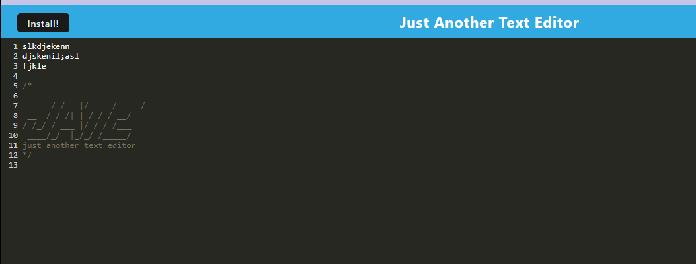

# JATE-Text-Editor

## Description:
    This is a text editing application that will let you take notes and will retrieve them when you come back to the app!  

## Table of Contents:
* [Installation](#installation)
* [Usage](#usage)
* [Credits](#credits)
* [License](#license)

## Installation
For installation for development, navigate to the root folder and run "npm install" to install "express", "if-env" , "concurrently", and "nodemon". Then navigate to the client directory and run npm install to install "webpack" "babel" "css-loader" "code-mirror-themes", and "idb". 

From the deployed app, click the "install" button on the top left of the window to install the application to your computer. 

## Usage
This is a simple text editor. You can type any text you want and it will remain there if you refresh the page or re-open the installed app. You can also go between the web app and installed app and get the same content. 

## Credits

## License  

## Tests

## Questions

github repo:
https://github.com/jensandage1/Progressive-Web-App-Text-Editor

Deployed App:
https://jate-text-editor-mod-19-41afa2aa7929.herokuapp.com/

